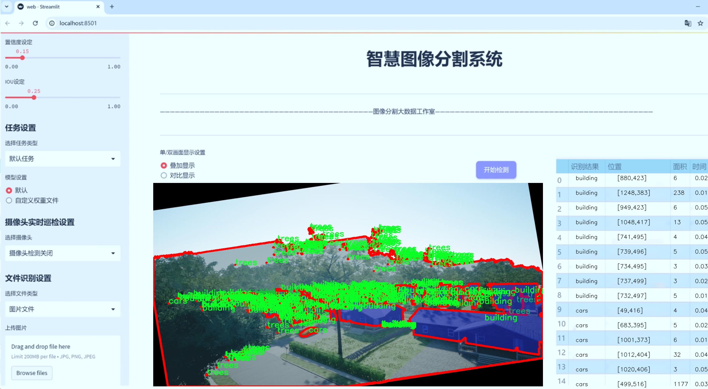
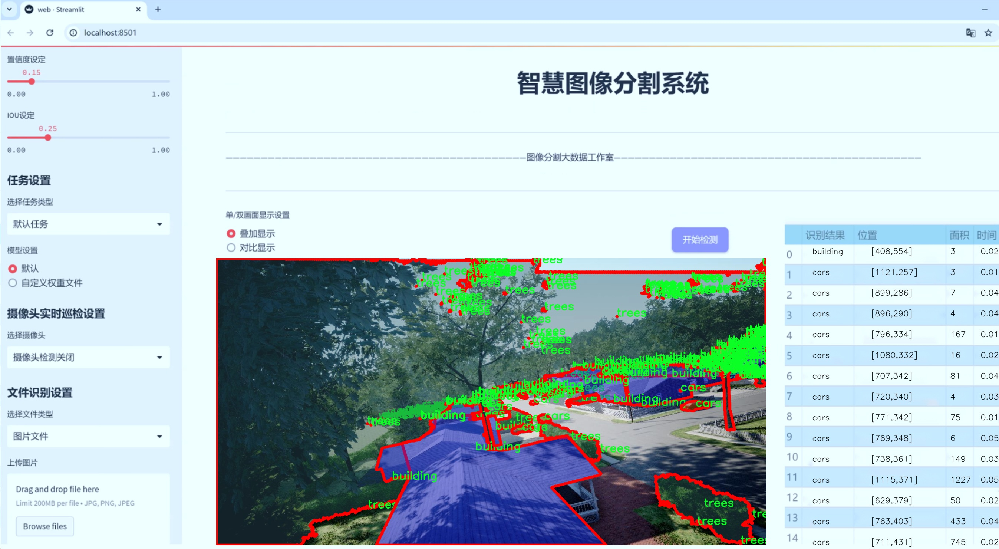
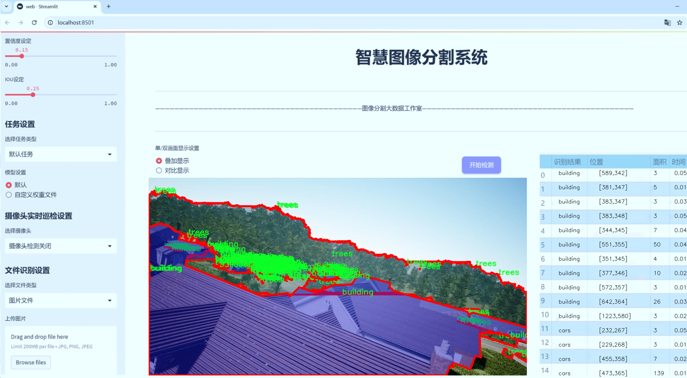
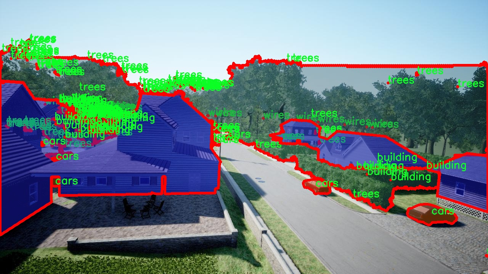
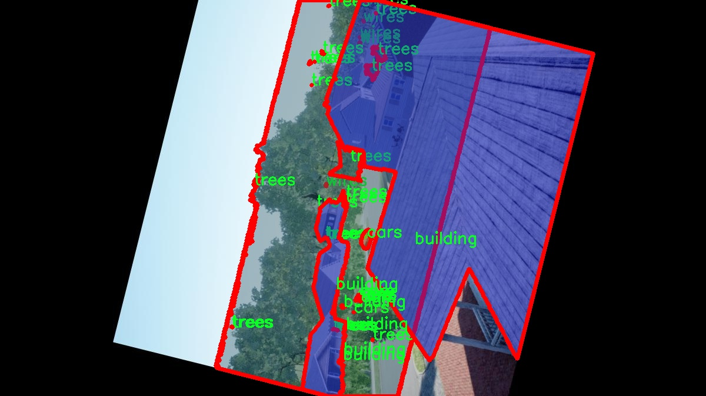
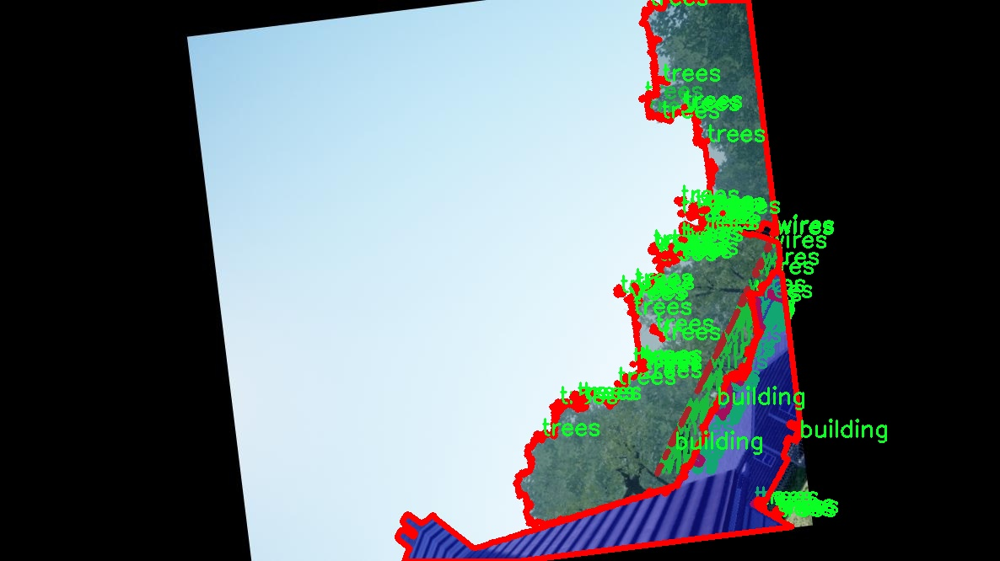
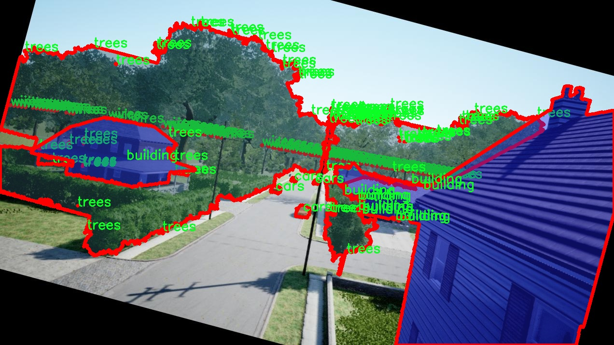
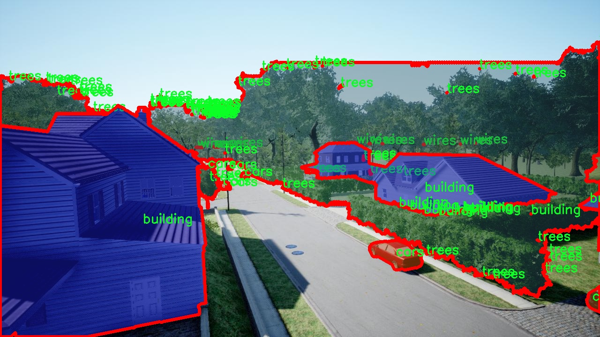

# 无人机场景城市环境图像分割系统： yolov8-seg-timm

### 1.研究背景与意义

[参考博客](https://gitee.com/YOLOv8_YOLOv11_Segmentation_Studio/projects)

[博客来源](https://kdocs.cn/l/cszuIiCKVNis)

研究背景与意义

随着城市化进程的加速，城市环境的复杂性和多样性日益增加，这对无人机在城市环境中的应用提出了更高的要求。无人机作为一种新兴的技术手段，因其灵活性和高效性，广泛应用于城市监测、交通管理、环境保护等领域。然而，传统的图像处理技术在面对复杂的城市环境时，往往难以满足实时性和准确性的双重需求。因此，基于深度学习的图像分割技术逐渐成为研究的热点，其中YOLO（You Only Look Once）系列模型因其高效的目标检测能力而备受关注。

YOLOv8作为YOLO系列的最新版本，进一步提升了目标检测的精度和速度，但在特定的应用场景中，仍存在一定的局限性。特别是在城市环境中，建筑物、车辆、树木和电线等多种目标的复杂交互，使得图像分割任务变得更加困难。因此，针对这一问题，改进YOLOv8以适应无人机场景的城市环境图像分割显得尤为重要。

本研究旨在构建一个基于改进YOLOv8的无人机场景城市环境图像分割系统。该系统将利用2400张图像的数据集，涵盖建筑物、车辆、树木和电线四个类别。这些类别不仅是城市环境中常见的元素，也是影响城市管理和监测的重要因素。通过对这些目标的精确分割，能够为城市规划、交通流量分析和环境监测提供更为详实的数据支持。

在技术层面，本研究将通过对YOLOv8模型的改进，优化其在城市环境中图像分割的性能。具体而言，将结合深度学习中的最新技术，如特征金字塔网络（FPN）、注意力机制等，提升模型对复杂背景和目标遮挡的鲁棒性。此外，针对数据集中的多样性和复杂性，将采用数据增强技术，提升模型的泛化能力，确保其在不同城市环境下的适用性。

本研究的意义不仅在于技术层面的创新，更在于其对城市管理和环境保护的实际应用价值。通过高效的图像分割系统，无人机能够实时获取城市环境的变化信息，帮助决策者及时调整城市规划和管理策略。同时，该系统还可以为环境监测提供重要的数据支持，助力可持续发展目标的实现。

综上所述，基于改进YOLOv8的无人机场景城市环境图像分割系统的研究，不仅填补了现有技术在城市环境应用中的空白，也为未来无人机技术的发展提供了新的思路和方向。通过这一研究，我们期待能够推动无人机在城市管理、交通监测和环境保护等领域的广泛应用，为智慧城市的建设贡献力量。

### 2.图片演示







注意：本项目提供完整的训练源码数据集和训练教程,由于此博客编辑较早,暂不提供权重文件（best.pt）,需要按照6.训练教程进行训练后实现上图效果。

### 3.视频演示

[3.1 视频演示](https://www.bilibili.com/video/BV1LuB4YTEGM/)

### 4.数据集信息

##### 4.1 数据集类别数＆类别名

nc: 4
names: ['building', 'cars', 'trees', 'wires']


##### 4.2 数据集信息简介

数据集信息展示

在现代城市环境中，无人机的应用日益广泛，尤其是在图像分割任务中，准确识别和分离不同物体的能力至关重要。为此，我们构建了一个名为“DDOS-YOLO”的数据集，旨在为改进YOLOv8-seg的无人机场景图像分割系统提供高质量的训练数据。该数据集专注于城市环境中的特定物体，包含四个主要类别：建筑物、汽车、树木和电线。这些类别的选择不仅反映了城市环境的典型特征，也为无人机在执行任务时提供了必要的上下文信息。

“DDOS-YOLO”数据集的设计考虑到了城市环境的复杂性和多样性。建筑物作为城市的主要构成部分，其形状、颜色和高度各异，能够在图像中形成显著的视觉特征。数据集中包含的建筑物图像涵盖了不同风格和年代的建筑，从现代摩天大楼到传统的低层建筑，确保了模型在各种建筑类型上的适应性和准确性。

汽车是城市交通的重要组成部分，数据集中包括了多种类型的汽车，从小型轿车到大型货车，甚至是公共交通工具。这种多样性使得模型能够学习到不同汽车在不同场景下的特征，从而提高其在动态城市环境中的检测能力。此外，汽车的颜色和形状变化也为图像分割提供了丰富的样本，增强了模型的泛化能力。

树木作为城市绿化的重要元素，其在图像中的表现同样多样。数据集中收录了不同种类和形态的树木，包括高大的乔木和矮小的灌木。这些树木不仅在视觉上提供了丰富的背景信息，也在无人机的飞行路径规划和障碍物检测中起到了关键作用。通过对树木的准确分割，模型能够更好地理解环境，避免潜在的碰撞风险。

电线是城市环境中常见但容易被忽视的元素，尤其是在无人机飞行时，电线的存在可能会对飞行安全造成威胁。因此，在“DDOS-YOLO”数据集中，电线的图像样本被精心挑选，以确保模型能够准确识别并避开这些潜在的障碍。电线的多样性和复杂性为图像分割任务增加了挑战，但同时也提升了模型的实用性。

总的来说，“DDOS-YOLO”数据集通过涵盖建筑物、汽车、树木和电线四个类别，为改进YOLOv8-seg的无人机场景图像分割系统提供了丰富的训练素材。该数据集不仅关注物体的视觉特征，还考虑了它们在城市环境中的实际应用场景，旨在提升无人机在复杂城市环境中的智能识别和分割能力。通过对这些类别的深入学习，模型将能够在实际应用中更好地执行任务，确保无人机在城市环境中的安全与效率。











### 5.项目依赖环境部署教程（零基础手把手教学）

[5.1 环境部署教程链接（零基础手把手教学）](https://www.bilibili.com/video/BV1jG4Ve4E9t/?vd_source=bc9aec86d164b67a7004b996143742dc)


[5.2 安装Python虚拟环境创建和依赖库安装视频教程链接（零基础手把手教学）](https://www.bilibili.com/video/BV1nA4VeYEze/?vd_source=bc9aec86d164b67a7004b996143742dc)

### 6.手把手YOLOV8-seg训练视频教程（零基础手把手教学）

[6.1 手把手YOLOV8-seg训练视频教程（零基础小白有手就能学会）](https://www.bilibili.com/video/BV1cA4VeYETe/?vd_source=bc9aec86d164b67a7004b996143742dc)


按照上面的训练视频教程链接加载项目提供的数据集，运行train.py即可开始训练



     Epoch   gpu_mem       box       obj       cls    labels  img_size
     1/200     0G   0.01576   0.01955  0.007536        22      1280: 100%|██████████| 849/849 [14:42<00:00,  1.04s/it]
               Class     Images     Labels          P          R     mAP@.5 mAP@.5:.95: 100%|██████████| 213/213 [01:14<00:00,  2.87it/s]
                 all       3395      17314      0.994      0.957      0.0957      0.0843

     Epoch   gpu_mem       box       obj       cls    labels  img_size
     2/200     0G   0.01578   0.01923  0.007006        22      1280: 100%|██████████| 849/849 [14:44<00:00,  1.04s/it]
               Class     Images     Labels          P          R     mAP@.5 mAP@.5:.95: 100%|██████████| 213/213 [01:12<00:00,  2.95it/s]
                 all       3395      17314      0.996      0.956      0.0957      0.0845

     Epoch   gpu_mem       box       obj       cls    labels  img_size
     3/200     0G   0.01561    0.0191  0.006895        27      1280: 100%|██████████| 849/849 [10:56<00:00,  1.29it/s]
               Class     Images     Labels          P          R     mAP@.5 mAP@.5:.95: 100%|███████   | 187/213 [00:52<00:00,  4.04it/s]
                 all       3395      17314      0.996      0.957      0.0957      0.0845


### 7.50+种全套YOLOV8-seg创新点加载调参实验视频教程（一键加载写好的改进模型的配置文件）

[7.1 50+种全套YOLOV8-seg创新点加载调参实验视频教程（一键加载写好的改进模型的配置文件）](https://www.bilibili.com/video/BV1Hw4VePEXv/?vd_source=bc9aec86d164b67a7004b996143742dc)

### YOLOV8-seg算法简介

原始YOLOV8-seg算法原理

YOLO（You Only Look Once）系列算法自问世以来，凭借其高效的实时目标检测能力和逐步优化的网络结构，逐渐成为计算机视觉领域的重要工具。YOLOv8作为该系列的最新版本，结合了深度学习的最新进展，进一步提升了检测精度和速度。YOLOv8-seg则是在YOLOv8的基础上，增加了图像分割的能力，使得该算法不仅能够进行目标检测，还能够对目标进行像素级的分割，适应更为复杂的应用场景。

YOLOv8的网络结构由四个主要部分组成：输入端、骨干网络（Backbone）、颈部网络（Neck）和头部网络（Head）。输入端负责对输入图像进行预处理，包括图像的缩放、增强（如马赛克增强）和自适应锚框计算等。通过这些预处理步骤，YOLOv8能够有效提高模型的鲁棒性和适应性，确保在不同环境下都能保持良好的性能。

在骨干网络部分，YOLOv8采用了改进的DarkNet结构，使用了C2f模块替代了传统的C3模块。C2f模块通过引入更多的分支和跨层连接，显著增强了梯度流动，使得网络能够更好地学习到丰富的特征表示。这种设计不仅提高了特征提取的能力，还保留了轻量级的特性，适合在资源受限的设备上运行。此外，YOLOv8还引入了空间金字塔池化（SPPF）模块，通过不同尺寸的池化操作对特征图进行融合，进一步提升了特征的表达能力。

颈部网络采用了路径聚合网络（PAN）结构，这一设计的核心在于加强了不同尺度特征的融合能力。通过特征金字塔和路径聚合的结合，YOLOv8能够有效地将语义信息与定位信息进行整合，从而提高对不同尺度目标的检测性能。这种特征融合策略在YOLOv8-seg中同样适用，使得模型在进行目标分割时能够获得更为准确的边界信息。

头部网络是YOLOv8的关键部分，采用了解耦头的结构，将分类和回归任务分开处理。这一设计不仅加速了模型的收敛速度，还提高了目标检测的精度。在YOLOv8-seg中，头部网络还需处理分割任务，因此在损失计算上进行了相应的调整。YOLOv8-seg在损失计算中引入了多种损失函数，包括二元交叉熵损失（BCELoss）和分布焦点损失（DFLoss），以优化模型在边界框预测和分割精度上的表现。

YOLOv8-seg的一个显著特点是其无锚框检测的能力。通过将传统的锚框机制替换为无锚框的检测策略，YOLOv8-seg能够减少锚框预测的数量，从而加速非最大抑制（NMS）过程。这一改进使得模型在处理复杂场景时，能够更快速地进行目标检测和分割，尤其在实时应用中表现尤为突出。

在实际应用中，YOLOv8-seg的优势体现在其高效的特征提取和融合能力，使得模型能够在各种复杂场景下实现高精度的目标检测和分割。无论是在自动驾驶、视频监控还是医学影像分析等领域，YOLOv8-seg都展现出了强大的适应性和实用性。通过不断优化的网络结构和创新的算法设计，YOLOv8-seg为计算机视觉的未来发展提供了新的可能性。

总之，YOLOv8-seg算法通过其独特的网络结构和高效的特征处理能力，成功地将目标检测与图像分割相结合，形成了一种新型的视觉理解方式。这一算法不仅提升了检测和分割的精度，还在实时性和资源利用率上做出了显著的贡献，为相关领域的研究和应用开辟了新的方向。随着技术的不断进步，YOLOv8-seg有望在更多的实际应用中发挥重要作用，推动计算机视觉技术的进一步发展。


### 9.系统功能展示（检测对象为举例，实际内容以本项目数据集为准）

图9.1.系统支持检测结果表格显示

  图9.2.系统支持置信度和IOU阈值手动调节

  图9.3.系统支持自定义加载权重文件best.pt(需要你通过步骤5中训练获得)

  图9.4.系统支持摄像头实时识别

  图9.5.系统支持图片识别

  图9.6.系统支持视频识别

  图9.7.系统支持识别结果文件自动保存

  图9.8.系统支持Excel导出检测结果数据


### 10.50+种全套YOLOV8-seg创新点原理讲解（非科班也可以轻松写刊发刊，V11版本正在科研待更新）

#### 10.1 由于篇幅限制，每个创新点的具体原理讲解就不一一展开，具体见下列网址中的创新点对应子项目的技术原理博客网址【Blog】：


[10.1 50+种全套YOLOV8-seg创新点原理讲解链接](https://gitee.com/qunmasj/good)

#### 10.2 部分改进模块原理讲解(完整的改进原理见上图和技术博客链接)【如果此小节的图加载失败可以通过CSDN或者Github搜索该博客的标题访问原始博客，原始博客图片显示正常】
### FasterNet简介
神经网络在图像分类、检测和分割等各种计算机视觉任务中经历了快速发展。尽管其令人印象深刻的性能为许多应用程序提供了动力，但一个巨大的趋势是追求具有低延迟和高吞吐量的快速神经网络，以获得良好的用户体验、即时响应和安全原因等。

如何快速？研究人员和从业者不需要更昂贵的计算设备，而是倾向于设计具有成本效益的快速神经网络，降低计算复杂度，主要以浮点运算（FLOPs）的数量来衡量。

MobileNet、ShuffleNet和GhostNet等利用深度卷积（DWConv）和/或组卷积（GConv）来提取空间特征。然而，在减少FLOPs的过程中，算子经常会受到内存访问增加的副作用的影响。MicroNet进一步分解和稀疏网络，将其FLOPs推至极低水平。尽管这种方法在FLOPs方面有所改进，但其碎片计算效率很低。此外，上述网络通常伴随着额外的数据操作，如级联、Shuffle和池化，这些操作的运行时间对于小型模型来说往往很重要。

除了上述纯卷积神经网络（CNNs）之外，人们对使视觉Transformer（ViTs）和多层感知器（MLP）架构更小更快也越来越感兴趣。例如，MobileViT和MobileFormer通过将DWConv与改进的注意力机制相结合，降低了计算复杂性。然而，它们仍然受到DWConv的上述问题的困扰，并且还需要修改的注意力机制的专用硬件支持。使用先进但耗时的标准化和激活层也可能限制其在设备上的速度。

所有这些问题一起导致了以下问题：这些“快速”的神经网络真的很快吗？为了回答这个问题，作者检查了延迟和FLOPs之间的关系，这由


其中FLOPS是每秒浮点运算的缩写，作为有效计算速度的度量。虽然有许多减少FLOPs的尝试，但都很少考虑同时优化FLOPs以实现真正的低延迟。为了更好地理解这种情况，作者比较了Intel CPU上典型神经网络的FLOPS。


图中的结果表明，许多现有神经网络的FLOPS较低，其FLOPS通常低于流行的ResNet50。由于FLOPS如此之低，这些“快速”的神经网络实际上不够快。它们的FLOPs减少不能转化为延迟的确切减少量。在某些情况下，没有任何改善，甚至会导致更糟的延迟。例如，CycleMLP-B1具有ResNet50的一半FLOPs，但运行速度较慢（即CycleMLPB1与ResNet50:111.9ms与69.4ms）。

请注意，FLOPs与延迟之间的差异在之前的工作中也已被注意到，但由于它们采用了DWConv/GConv和具有低FLOPs的各种数据处理，因此部分问题仍未解决。人们认为没有更好的选择。

该博客提供的方案通过开发一种简单、快速、有效的运算符来消除这种差异，该运算符可以在减少FLOPs的情况下保持高FLOPS。

具体来说，作者重新审视了现有的操作符，特别是DWConv的计算速度——FLOPS。作者发现导致低FLOPS问题的主要原因是频繁的内存访问。然后，作者提出了PConv作为一种竞争性替代方案，它减少了计算冗余以及内存访问的数量。

图1说明了PConv的设计。它利用了特征图中的冗余，并系统地仅在一部分输入通道上应用规则卷积（Conv），而不影响其余通道。本质上，PConv的FLOPs低于常规Conv，而FLOPs高于DWConv/GConv。换句话说，PConv更好地利用了设备上的计算能力。PConv在提取空间特征方面也很有效，这在本文后面的实验中得到了验证。

作者进一步引入PConv设计了FasterNet作为一个在各种设备上运行速度非常快的新网络家族。特别是，FasterNet在分类、检测和分割任务方面实现了最先进的性能，同时具有更低的延迟和更高的吞吐量。例如，在GPU、CPU和ARM处理器上，小模型FasterNet-T0分别比MobileVitXXS快3.1倍、3.1倍和2.5倍，而在ImageNet-1k上的准确率高2.9%。大模型FasterNet-L实现了83.5%的Top-1精度，与Swin-B不相上下，同时在GPU上提供了49%的高吞吐量，在CPU上节省了42%的计算时间。

总之，贡献如下：

指出了实现更高FLOPS的重要性，而不仅仅是为了更快的神经网络而减少FLOPs。

引入了一种简单但快速且有效的卷积PConv，它很有可能取代现有的选择DWConv。

推出FasterNet，它在GPU、CPU和ARM处理器等多种设备上运行良好且普遍快速。

对各种任务进行了广泛的实验，并验证了PConv和FasterNet的高速性和有效性。

### Conv和FasterNet的设计
#### 原理

DWConv是Conv的一种流行变体，已被广泛用作许多神经网络的关键构建块。对于输入，DWConv应用个滤波器来计算输出。如图（b）所示，每个滤波器在一个输入通道上进行空间滑动，并对一个输出通道做出贡献。

与具有的FLOPs常规Conv相比，这种深度计算使得DWConv仅仅具有的FLOPs。虽然在减少FLOPs方面有效，但DWConv（通常后跟逐点卷积或PWConv）不能简单地用于替换常规Conv，因为它会导致严重的精度下降。因此，在实践中，DWConv的通道数（或网络宽度）增加到＞以补偿精度下降，例如，倒置残差块中的DWConv宽度扩展了6倍。然而，这会导致更高的内存访问，这会造成不可忽略的延迟，并降低总体计算速度，尤其是对于I/O绑定设备。特别是，内存访问的数量现在上升到


它比一个常规的Conv的值要高，即，


注意，内存访问花费在I/O操作上，这被认为已经是最小的成本，很难进一步优化。

#### PConv作为一个基本的算子


在下面演示了通过利用特征图的冗余度可以进一步优化成本。如图所示，特征图在不同通道之间具有高度相似性。许多其他著作也涵盖了这种冗余，但很少有人以简单而有效的方式充分利用它。


具体而言，作者提出了一种简单的PConv，以同时减少计算冗余和内存访问。图4中的左下角说明了PConv的工作原理。它只需在输入通道的一部分上应用常规Conv进行空间特征提取，并保持其余通道不变。对于连续或规则的内存访问，将第一个或最后一个连续的通道视为整个特征图的代表进行计算。在不丧失一般性的情况下认为输入和输出特征图具有相同数量的通道。因此，PConv的FLOPs仅


对于典型的r＝1/4 ，PConv的FLOPs只有常规Conv的1/16。此外，PConv的内存访问量较小，即：


对于r＝1/4，其仅为常规Conv的1/4。

由于只有通道用于空间特征提取，人们可能会问是否可以简单地移除剩余的（c−）通道？如果是这样，PConv将退化为具有较少通道的常规Conv，这偏离了减少冗余的目标。

请注意，保持其余通道不变，而不是从特征图中删除它们。这是因为它们对后续PWConv层有用，PWConv允许特征信息流经所有通道。

#### PConv之后是PWConv


为了充分有效地利用来自所有通道的信息，进一步将逐点卷积（PWConv）附加到PConv。它们在输入特征图上的有效感受野看起来像一个T形Conv，与均匀处理补丁的常规Conv相比，它更专注于中心位置，如图5所示。为了证明这个T形感受野的合理性，首先通过计算位置的Frobenius范数来评估每个位置的重要性。


假设，如果一个职位比其他职位具有更大的Frobenius范数，则该职位往往更重要。对于正则Conv滤波器，位置处的Frobenius范数由计算，其中。


一个显著位置是具有最大Frobenius范数的位置。然后，在预训练的ResNet18中集体检查每个过滤器，找出它们的显著位置，并绘制显著位置的直方图。图6中的结果表明，中心位置是过滤器中最常见的突出位置。换句话说，中心位置的权重比周围的更重。这与集中于中心位置的T形计算一致。

虽然T形卷积可以直接用于高效计算，但作者表明，将T形卷积分解为PConv和PWConv更好，因为该分解利用了滤波器间冗余并进一步节省了FLOPs。对于相同的输入和输出，T形Conv的FLOPs可以计算为:


它高于PConv和PWConv的流量，即：


其中和（例如，当时）。此外，可以很容易地利用常规Conv进行两步实现。

# FasterNet作为Backbone
鉴于新型PConv和现成的PWConv作为主要的算子，进一步提出FasterNet，这是一个新的神经网络家族，运行速度非常快，对许多视觉任务非常有效。目标是使体系结构尽可能简单，使其总体上对硬件友好。


在图中展示了整体架构。它有4个层次级，每个层次级前面都有一个嵌入层（步长为4的常规4×4卷积）或一个合并层（步长为2的常规2×2卷积），用于空间下采样和通道数量扩展。每个阶段都有一堆FasterNet块。作者观察到，最后两个阶段中的块消耗更少的内存访问，并且倾向于具有更高的FLOPS，如表1中的经验验证。因此，放置了更多FasterNet块，并相应地将更多计算分配给最后两个阶段。每个FasterNet块有一个PConv层，后跟2个PWConv（或Conv 1×1）层。它们一起显示为倒置残差块，其中中间层具有扩展的通道数量，并且放置了Shorcut以重用输入特征。

除了上述算子，标准化和激活层对于高性能神经网络也是不可或缺的。然而，许多先前的工作在整个网络中过度使用这些层，这可能会限制特征多样性，从而损害性能。它还可以降低整体计算速度。相比之下，只将它们放在每个中间PWConv之后，以保持特征多样性并实现较低的延迟。

此外，使用批次归一化（BN）代替其他替代方法。BN的优点是，它可以合并到其相邻的Conv层中，以便更快地进行推断，同时与其他层一样有效。对于激活层，根据经验选择了GELU用于较小的FasterNet变体，而ReLU用于较大的FasterNet变体，同时考虑了运行时间和有效性。最后三个层，即全局平均池化、卷积1×1和全连接层，一起用于特征转换和分类。

为了在不同的计算预算下提供广泛的应用，提供FasterNet的Tiny模型、Small模型、Medium模型和Big模型变体，分别称为FasterNetT0/1/2、FasterNet-S、FasterNet-M和FasterNet-L。它们具有相似的结构，但深度和宽度不同。

架构规范如下：


### 11.项目核心源码讲解（再也不用担心看不懂代码逻辑）

#### 11.1 ultralytics\utils\callbacks\comet.py

以下是对给定代码的核心部分进行提炼和详细中文注释的结果：

```python
# 导入必要的库
from ultralytics.utils import LOGGER, RANK, SETTINGS, TESTS_RUNNING, ops
import os
from pathlib import Path

# 检查Comet集成是否启用
try:
    assert not TESTS_RUNNING  # 确保不在pytest测试中
    assert SETTINGS['comet'] is True  # 确保Comet集成已启用
    import comet_ml  # 导入Comet库
    assert hasattr(comet_ml, '__version__')  # 确保Comet库不是目录
except (ImportError, AssertionError):
    comet_ml = None  # 如果导入失败，则将comet_ml设置为None

# 获取Comet实验的模式（在线或离线）
def _get_comet_mode():
    return os.getenv('COMET_MODE', 'online')

# 获取Comet模型名称
def _get_comet_model_name():
    return os.getenv('COMET_MODEL_NAME', 'YOLOv8')

# 创建Comet实验
def _create_experiment(args):
    """确保在分布式训练中只在一个进程中创建实验对象。"""
    if RANK not in (-1, 0):  # 仅在主进程中创建实验
        return
    try:
        comet_mode = _get_comet_mode()
        _project_name = os.getenv('COMET_PROJECT_NAME', args.project)
        experiment = comet_ml.OfflineExperiment(project_name=_project_name) if comet_mode == 'offline' else comet_ml.Experiment(project_name=_project_name)
        experiment.log_parameters(vars(args))  # 记录参数
    except Exception as e:
        LOGGER.warning(f'WARNING ⚠️ Comet安装但未正确初始化，未记录此运行。{e}')

# 记录混淆矩阵
def _log_confusion_matrix(experiment, trainer, curr_step, curr_epoch):
    """将混淆矩阵记录到Comet实验中。"""
    conf_mat = trainer.validator.confusion_matrix.matrix  # 获取混淆矩阵
    names = list(trainer.data['names'].values()) + ['background']  # 获取类别名称
    experiment.log_confusion_matrix(
        matrix=conf_mat,
        labels=names,
        max_categories=len(names),
        epoch=curr_epoch,
        step=curr_step,
    )

# 记录图像
def _log_images(experiment, image_paths, curr_step, annotations=None):
    """将图像记录到实验中，带有可选注释。"""
    if annotations:
        for image_path, annotation in zip(image_paths, annotations):
            experiment.log_image(image_path, name=image_path.stem, step=curr_step, annotations=annotation)
    else:
        for image_path in image_paths:
            experiment.log_image(image_path, name=image_path.stem, step=curr_step)

# 训练结束时的操作
def on_train_end(trainer):
    """在训练结束时执行操作。"""
    experiment = comet_ml.get_global_experiment()  # 获取全局实验
    if not experiment:
        return

    metadata = _fetch_trainer_metadata(trainer)  # 获取训练元数据
    curr_epoch = metadata['curr_epoch']
    curr_step = metadata['curr_step']

    _log_confusion_matrix(experiment, trainer, curr_step, curr_epoch)  # 记录混淆矩阵
    experiment.end()  # 结束实验

# 定义回调函数
callbacks = {
    'on_train_end': on_train_end
} if comet_ml else {}
```

### 代码分析和注释说明：

1. **导入库**：首先导入了必要的库，包括Ultralytics的工具和Comet库，用于实验记录和可视化。

2. **Comet集成检查**：通过`try-except`块确保Comet库被正确导入并且集成设置已启用。

3. **获取环境变量**：定义了一些函数来获取环境变量，例如Comet的模式、模型名称等，这些都是用于配置实验的参数。

4. **创建实验**：`_create_experiment`函数负责创建Comet实验对象，并记录训练参数。它确保在分布式训练中只在主进程中创建实验。

5. **记录混淆矩阵**：`_log_confusion_matrix`函数用于将混淆矩阵记录到Comet实验中，帮助可视化模型的分类性能。

6. **记录图像**：`_log_images`函数将训练过程中生成的图像记录到Comet实验中，可以附加注释以便于后续分析。

7. **训练结束时的操作**：`on_train_end`函数在训练结束时执行，记录混淆矩阵并结束Comet实验。

8. **回调函数**：最后，定义了一个回调字典，用于在训练结束时调用相应的函数。

通过这些核心部分的提炼和注释，可以更清晰地理解代码的功能和结构。

这个文件是Ultralytics YOLO项目中的一个回调模块，主要用于与Comet.ml进行集成，以便在训练过程中记录和可视化模型的训练和评估结果。文件的开头部分导入了一些必要的库和模块，并进行了初步的环境检查，确保在进行Comet.ml的操作时，相关的设置和库都是可用的。

文件中定义了一系列函数，这些函数的主要功能包括获取环境变量、创建Comet实验、格式化真实标签和预测结果、记录混淆矩阵、图像和模型等。具体来说，首先通过环境变量获取Comet的运行模式、模型名称、评估批次日志间隔、最大图像预测数量等设置。然后，定义了一些用于处理和格式化数据的函数，例如将YOLOv8训练中生成的边界框标签从缩放后的图像形状转换回原始图像形状，以及格式化真实标签和预测结果以便于记录。

在训练过程中，文件中的回调函数会在特定的时刻被调用，例如在预训练开始时、每个训练周期结束时、每次拟合周期结束时以及训练结束时。这些回调函数会负责记录当前的训练状态、损失、混淆矩阵、图像预测等信息到Comet实验中。通过这些记录，用户可以在Comet.ml平台上实时监控模型的训练过程，查看训练和验证的指标、可视化的图像以及模型的性能。

此外，文件中还定义了一些条件判断，以确保只有在特定条件下才会记录混淆矩阵和图像预测。例如，只有在设置中启用了相应的选项时，才会记录这些信息。这种设计使得模块在不同的训练任务中具有灵活性和可配置性。

最后，文件将定义的回调函数组织成一个字典，以便在训练过程中根据需要调用。整体来看，这个模块为YOLO模型的训练提供了一个强大的日志记录和可视化工具，帮助开发者更好地理解和优化模型的性能。

#### 11.2 ultralytics\nn\extra_modules\afpn.py

以下是保留的核心代码部分，并附上详细的中文注释：

```python
import torch
import torch.nn as nn
import torch.nn.functional as F
from ..modules.conv import Conv

class BasicBlock(nn.Module):
    """基本块，包含两个卷积层和残差连接"""
    def __init__(self, filter_in, filter_out):
        super(BasicBlock, self).__init__()
        # 第一个卷积层，使用3x3卷积
        self.conv1 = Conv(filter_in, filter_out, 3)
        # 第二个卷积层，使用3x3卷积，不使用激活函数
        self.conv2 = Conv(filter_out, filter_out, 3, act=False)

    def forward(self, x):
        residual = x  # 保存输入以便进行残差连接
        out = self.conv1(x)  # 通过第一个卷积层
        out = self.conv2(out)  # 通过第二个卷积层
        out += residual  # 添加残差
        return self.conv1.act(out)  # 通过激活函数并返回

class Upsample(nn.Module):
    """上采样模块，使用1x1卷积和双线性插值"""
    def __init__(self, in_channels, out_channels, scale_factor=2):
        super(Upsample, self).__init__()
        self.upsample = nn.Sequential(
            Conv(in_channels, out_channels, 1),  # 1x1卷积
            nn.Upsample(scale_factor=scale_factor, mode='bilinear')  # 双线性插值上采样
        )

    def forward(self, x):
        return self.upsample(x)  # 执行上采样

class Downsample_x2(nn.Module):
    """下采样模块，使用2x2卷积"""
    def __init__(self, in_channels, out_channels):
        super(Downsample_x2, self).__init__()
        self.downsample = Conv(in_channels, out_channels, 2, 2, 0)  # 2x2卷积

    def forward(self, x):
        return self.downsample(x)  # 执行下采样

class ASFF_2(nn.Module):
    """自适应特征融合模块，处理两个输入特征图"""
    def __init__(self, inter_dim=512):
        super(ASFF_2, self).__init__()
        self.inter_dim = inter_dim
        compress_c = 8  # 压缩通道数

        # 为每个输入特征图创建权重卷积
        self.weight_level_1 = Conv(self.inter_dim, compress_c, 1)
        self.weight_level_2 = Conv(self.inter_dim, compress_c, 1)
        self.weight_levels = nn.Conv2d(compress_c * 2, 2, kernel_size=1)  # 计算融合权重
        self.conv = Conv(self.inter_dim, self.inter_dim, 3)  # 融合后的卷积

    def forward(self, input1, input2):
        # 计算每个输入的权重
        level_1_weight_v = self.weight_level_1(input1)
        level_2_weight_v = self.weight_level_2(input2)

        # 合并权重并计算最终权重
        levels_weight_v = torch.cat((level_1_weight_v, level_2_weight_v), 1)
        levels_weight = self.weight_levels(levels_weight_v)
        levels_weight = F.softmax(levels_weight, dim=1)  # 归一化权重

        # 融合输入特征图
        fused_out_reduced = input1 * levels_weight[:, 0:1, :, :] + \
                            input2 * levels_weight[:, 1:2, :, :]

        out = self.conv(fused_out_reduced)  # 通过卷积层
        return out  # 返回融合后的特征图

class BlockBody_P345(nn.Module):
    """特征块体，处理三个不同尺度的特征图"""
    def __init__(self, channels=[64, 128, 256, 512]):
        super(BlockBody_P345, self).__init__()

        # 定义不同尺度的卷积块
        self.blocks_scalezero1 = nn.Sequential(Conv(channels[0], channels[0], 1))
        self.blocks_scaleone1 = nn.Sequential(Conv(channels[1], channels[1], 1))
        self.blocks_scaletwo1 = nn.Sequential(Conv(channels[2], channels[2], 1))

        # 定义下采样和上采样模块
        self.downsample_scalezero1_2 = Downsample_x2(channels[0], channels[1])
        self.upsample_scaleone1_2 = Upsample(channels[1], channels[0], scale_factor=2)

        # 定义自适应特征融合模块
        self.asff_scalezero1 = ASFF_2(inter_dim=channels[0])
        self.asff_scaleone1 = ASFF_2(inter_dim=channels[1])

        # 定义后续的卷积块
        self.blocks_scalezero2 = nn.Sequential(
            BasicBlock(channels[0], channels[0]),
            BasicBlock(channels[0], channels[0]),
            BasicBlock(channels[0], channels[0]),
            BasicBlock(channels[0], channels[0]),
        )
        self.blocks_scaleone2 = nn.Sequential(
            BasicBlock(channels[1], channels[1]),
            BasicBlock(channels[1], channels[1]),
            BasicBlock(channels[1], channels[1]),
            BasicBlock(channels[1], channels[1]),
        )

    def forward(self, x):
        x0, x1, x2 = x  # 输入特征图

        # 处理每个尺度的特征图
        x0 = self.blocks_scalezero1(x0)
        x1 = self.blocks_scaleone1(x1)
        x2 = self.blocks_scaletwo1(x2)

        # 进行自适应特征融合
        scalezero = self.asff_scalezero1(x0, self.upsample_scaleone1_2(x1))
        scaleone = self.asff_scaleone1(self.downsample_scalezero1_2(x0), x1)

        # 通过后续卷积块处理融合后的特征图
        x0 = self.blocks_scalezero2(scalezero)
        x1 = self.blocks_scaleone2(scaleone)

        return x0, x1  # 返回处理后的特征图

class AFPN_P345(nn.Module):
    """自适应特征金字塔网络，处理三个输入特征图"""
    def __init__(self, in_channels=[256, 512, 1024], out_channels=256, factor=4):
        super(AFPN_P345, self).__init__()

        # 定义输入特征图的卷积层
        self.conv0 = Conv(in_channels[0], in_channels[0] // factor, 1)
        self.conv1 = Conv(in_channels[1], in_channels[1] // factor, 1)
        self.conv2 = Conv(in_channels[2], in_channels[2] // factor, 1)

        # 定义特征块体
        self.body = BlockBody_P345([in_channels[0] // factor, in_channels[1] // factor, in_channels[2] // factor])

        # 定义输出特征图的卷积层
        self.conv00 = Conv(in_channels[0] // factor, out_channels, 1)
        self.conv11 = Conv(in_channels[1] // factor, out_channels, 1)
        self.conv22 = Conv(in_channels[2] // factor, out_channels, 1)

    def forward(self, x):
        x0, x1, x2 = x  # 输入特征图

        # 通过卷积层处理输入特征图
        x0 = self.conv0(x0)
        x1 = self.conv1(x1)
        x2 = self.conv2(x2)

        # 通过特征块体处理特征图
        out0, out1, out2 = self.body([x0, x1, x2])

        # 通过输出卷积层处理特征图
        out0 = self.conv00(out0)
        out1 = self.conv11(out1)
        out2 = self.conv22(out2)

        return [out0, out1, out2]  # 返回输出特征图
```

### 代码说明：
1. **BasicBlock**: 定义了一个基本的卷积块，包含两个卷积层和残差连接。
2. **Upsample 和 Downsample**: 定义了上采样和下采样模块，分别用于特征图的尺寸调整。
3. **ASFF_2**: 自适应特征融合模块，能够融合两个输入特征图，输出融合后的特征图。
4. **BlockBody_P345**: 处理三个不同尺度的特征图，包含卷积块和自适应特征融合模块。
5. **AFPN_P345**: 自适应特征金字塔网络，处理三个输入特征图并输出融合后的特征图。

这些模块共同构成了一个特征提取和融合的深度学习模型，适用于图像处理任务。

这个程序文件实现了一个名为“AFPN”的模块，主要用于深度学习中的特征金字塔网络（FPN）结构。文件中定义了多个类，每个类代表网络中的不同组件，使用了PyTorch框架来构建神经网络。

首先，文件引入了一些必要的库，包括`OrderedDict`、`torch`、`torch.nn`和`torch.nn.functional`，并从其他模块导入了一些自定义的卷积和块结构。

接下来，定义了多个类，其中`BasicBlock`类实现了一个基本的残差块，包含两个卷积层和残差连接。`Upsample`和`Downsample_x2/x4/x8`类分别实现了上采样和不同倍数的下采样操作。这些操作在特征金字塔网络中非常重要，因为它们帮助网络在不同的尺度上处理特征。

`ASFF_2/3/4`类实现了自适应特征融合模块（ASFF），用于在不同层次的特征之间进行加权融合。每个ASFF模块根据输入特征计算权重，并通过加权和的方式融合不同层次的特征。

`BlockBody_P345`和`BlockBody_P2345`类则是特征金字塔网络的主体部分，包含多个卷积块和ASFF模块，负责处理不同尺度的特征。它们通过上下采样和特征融合，逐步构建出最终的特征表示。

`AFPN_P345`和`AFPN_P2345`类是整个网络的主要入口，负责接收输入特征并通过一系列卷积和块体处理，最终输出经过处理的特征。这些类还包括初始化权重的代码，以确保网络在训练开始时具有良好的性能。

最后，`AFPN_P345_Custom`和`AFPN_P2345_Custom`类允许用户自定义块类型，以便在特定任务中使用不同的网络结构。

整体来看，这个文件实现了一个灵活且可扩展的特征金字塔网络结构，适用于多种计算机视觉任务，如目标检测和图像分割。通过不同的块类型和参数设置，用户可以根据具体需求调整网络的架构。

#### 11.3 ui.py

```python
import sys
import subprocess

def run_script(script_path):
    """
    使用当前 Python 环境运行指定的脚本。

    Args:
        script_path (str): 要运行的脚本路径

    Returns:
        None
    """
    # 获取当前 Python 解释器的路径
    python_path = sys.executable

    # 构建运行命令，使用 streamlit 运行指定的脚本
    command = f'"{python_path}" -m streamlit run "{script_path}"'

    # 执行命令
    result = subprocess.run(command, shell=True)
    # 检查命令执行结果，如果返回码不为0，表示出错
    if result.returncode != 0:
        print("脚本运行出错。")

# 实例化并运行应用
if __name__ == "__main__":
    # 指定要运行的脚本路径
    script_path = "web.py"  # 这里可以直接指定脚本路径

    # 运行脚本
    run_script(script_path)
```

### 代码注释说明：
1. **导入模块**：
   - `sys`：用于访问与 Python 解释器紧密相关的变量和函数。
   - `subprocess`：用于执行外部命令和程序。

2. **`run_script` 函数**：
   - 该函数接收一个脚本路径作为参数，并使用当前 Python 环境运行该脚本。
   - 使用 `sys.executable` 获取当前 Python 解释器的路径，以确保使用正确的 Python 环境。
   - 构建一个命令字符串，使用 `streamlit` 模块运行指定的脚本。
   - 使用 `subprocess.run` 执行命令，并检查返回码以判断脚本是否成功运行。

3. **主程序块**：
   - 通过 `if __name__ == "__main__":` 确保该代码块仅在直接运行脚本时执行。
   - 指定要运行的脚本路径（这里直接指定为 `"web.py"`）。
   - 调用 `run_script` 函数来执行指定的脚本。

这个程序文件的主要功能是通过当前的 Python 环境来运行一个指定的脚本，具体是一个名为 `web.py` 的文件。程序首先导入了必要的模块，包括 `sys`、`os` 和 `subprocess`，以及一个自定义的路径处理函数 `abs_path`。

在 `run_script` 函数中，程序接受一个参数 `script_path`，这是要运行的脚本的路径。函数内部首先获取当前 Python 解释器的路径，这样可以确保在正确的环境中运行脚本。接着，程序构建了一个命令字符串，该命令使用 `streamlit` 来运行指定的脚本。`streamlit` 是一个用于构建数据应用的流行库。

使用 `subprocess.run` 方法，程序执行构建好的命令，并通过 `shell=True` 参数允许在 shell 中执行该命令。执行后，程序检查返回码，如果返回码不为零，表示脚本运行出错，则打印出相应的错误信息。

在文件的最后部分，程序通过 `if __name__ == "__main__":` 语句来确保只有在直接运行该文件时才会执行后面的代码。在这里，程序调用 `abs_path` 函数来获取 `web.py` 的绝对路径，并将其传递给 `run_script` 函数以启动脚本的运行。

总的来说，这个程序的设计目的是为了方便地在指定的 Python 环境中运行一个 Streamlit 应用脚本，确保用户能够轻松启动和管理数据应用。

#### 11.4 ultralytics\trackers\__init__.py

以下是代码中最核心的部分，并附上详细的中文注释：

```python
# 导入所需的跟踪器类
from .bot_sort import BOTSORT  # 导入BOTSORT类，用于目标跟踪
from .byte_tracker import BYTETracker  # 导入BYTETracker类，用于目标跟踪
from .track import register_tracker  # 导入注册跟踪器的函数

# 定义模块的公开接口，允许用户更简单地导入这些类和函数
__all__ = 'register_tracker', 'BOTSORT', 'BYTETracker'  
```

### 注释说明：
1. **导入部分**：
   - `from .bot_sort import BOTSORT`：从当前模块的 `bot_sort` 文件中导入 `BOTSORT` 类，该类可能实现了一种基于SORT（Simple Online and Realtime Tracking）算法的目标跟踪方法。
   - `from .byte_tracker import BYTETracker`：从当前模块的 `byte_tracker` 文件中导入 `BYTETracker` 类，该类可能实现了一种基于BYTE（ByteTrack）算法的目标跟踪方法。
   - `from .track import register_tracker`：从当前模块的 `track` 文件中导入 `register_tracker` 函数，该函数可能用于注册不同的跟踪器，以便在系统中使用。

2. **`__all__` 定义**：
   - `__all__` 是一个特殊变量，用于定义当使用 `from module import *` 语句时，哪些名称是可以被导入的。在这里，它包含了 `register_tracker`、`BOTSORT` 和 `BYTETracker`，这意味着这些是模块的公共接口，用户可以直接使用这些类和函数。

这个程序文件是一个Python模块的初始化文件，位于`ultralytics/trackers`目录下。文件的开头有一行注释，表明该模块是Ultralytics YOLO项目的一部分，并且遵循AGPL-3.0许可证。

接下来，文件通过相对导入的方式引入了三个组件：`BOTSORT`、`BYTETracker`和`register_tracker`。这些组件分别来自于同一目录下的`bot_sort.py`、`byte_tracker.py`和`track.py`文件。这种结构使得模块内的功能可以被其他模块或脚本轻松使用。

最后，`__all__`变量被定义为一个包含字符串的元组，列出了可以通过`from module import *`语句导入的公共接口。这意味着当其他模块使用这种方式导入时，只会导入`register_tracker`、`BOTSORT`和`BYTETracker`这三个组件，从而避免了不必要的名称冲突和保护内部实现细节。

总体而言，这个初始化文件的主要作用是组织和简化模块的导入，使得使用者能够方便地访问跟踪相关的功能。

#### 11.5 ultralytics\utils\atss.py

以下是经过简化和注释的核心代码部分：

```python
import torch
import torch.nn as nn
import torch.nn.functional as F

def bbox_overlaps(bboxes1, bboxes2, mode='iou', is_aligned=False, eps=1e-6):
    """计算两个边界框集合之间的重叠程度。

    Args:
        bboxes1 (Tensor): 第一个边界框集合，形状为 (M, 4)。
        bboxes2 (Tensor): 第二个边界框集合，形状为 (N, 4)。
        mode (str): 计算模式，可以是 'iou'（交并比），'iof'（前景交集），或 'giou'（广义交并比）。
        is_aligned (bool): 如果为 True，则 bboxes1 和 bboxes2 的大小必须相等。
        eps (float): 为了数值稳定性，添加到分母的值。

    Returns:
        Tensor: 重叠程度的张量，形状为 (M, N) 或 (M,)。
    """
    assert mode in ['iou', 'iof', 'giou'], f'不支持的模式 {mode}'
    assert (bboxes1.size(-1) == 4 or bboxes1.size(0) == 0)
    assert (bboxes2.size(-1) == 4 or bboxes2.size(0) == 0)

    # 计算每个边界框的面积
    area1 = (bboxes1[..., 2] - bboxes1[..., 0]) * (bboxes1[..., 3] - bboxes1[..., 1])
    area2 = (bboxes2[..., 2] - bboxes2[..., 0]) * (bboxes2[..., 3] - bboxes2[..., 1])

    # 计算重叠区域的左上角和右下角坐标
    lt = torch.max(bboxes1[..., :2], bboxes2[..., :2])  # 左上角
    rb = torch.min(bboxes1[..., 2:], bboxes2[..., 2:])  # 右下角

    # 计算重叠区域的宽和高
    wh = (rb - lt).clamp(min=0)  # 确保宽高不为负
    overlap = wh[..., 0] * wh[..., 1]  # 重叠面积

    # 计算并集
    union = area1 + area2 - overlap + eps  # 添加 eps 避免除零错误
    ious = overlap / union  # 计算 IoU

    return ious  # 返回 IoU 结果

class ATSSAssigner(nn.Module):
    '''自适应训练样本选择分配器'''
    def __init__(self, topk=9, num_classes=80):
        super(ATSSAssigner, self).__init__()
        self.topk = topk  # 每个样本选择的候选框数量
        self.num_classes = num_classes  # 类别数量
        self.bg_idx = num_classes  # 背景类别索引

    @torch.no_grad()
    def forward(self, anc_bboxes, n_level_bboxes, gt_labels, gt_bboxes, mask_gt, pd_bboxes):
        """分配目标标签和边界框。

        Args:
            anc_bboxes (Tensor): 形状为 (num_total_anchors, 4) 的锚框。
            n_level_bboxes (List): 每个层级的边界框数量。
            gt_labels (Tensor): 形状为 (bs, n_max_boxes, 1) 的真实标签。
            gt_bboxes (Tensor): 形状为 (bs, n_max_boxes, 4) 的真实边界框。
            mask_gt (Tensor): 形状为 (bs, n_max_boxes, 1) 的掩码。
            pd_bboxes (Tensor): 形状为 (bs, n_max_boxes, 4) 的预测边界框。

        Returns:
            target_labels (Tensor): 形状为 (bs, num_total_anchors) 的目标标签。
            target_bboxes (Tensor): 形状为 (bs, num_total_anchors, 4) 的目标边界框。
            target_scores (Tensor): 形状为 (bs, num_total_anchors, num_classes) 的目标分数。
            fg_mask (Tensor): 形状为 (bs, num_total_anchors) 的前景掩码。
        """
        self.n_anchors = anc_bboxes.size(0)  # 锚框数量
        self.bs = gt_bboxes.size(0)  # 批次大小
        self.n_max_boxes = gt_bboxes.size(1)  # 最大边界框数量

        if self.n_max_boxes == 0:  # 如果没有真实边界框
            device = gt_bboxes.device
            return (torch.full([self.bs, self.n_anchors], self.bg_idx).to(device),
                    torch.zeros([self.bs, self.n_anchors, 4]).to(device),
                    torch.zeros([self.bs, self.n_anchors, self.num_classes]).to(device),
                    torch.zeros([self.bs, self.n_anchors]).to(device))

        # 计算重叠和距离
        overlaps = bbox_overlaps(gt_bboxes.reshape([-1, 4]), anc_bboxes)
        overlaps = overlaps.reshape([self.bs, -1, self.n_anchors])

        # 选择候选框
        # ...（省略选择候选框的详细实现）

        return target_labels, target_bboxes, target_scores, fg_mask.bool(), target_gt_idx
```

### 代码注释说明：
1. **bbox_overlaps** 函数用于计算两个边界框集合之间的重叠程度，支持不同的计算模式（IoU、IoF、GIoU）。
2. **ATSSAssigner** 类是一个自适应训练样本选择分配器，主要用于将锚框与真实边界框进行匹配，并返回目标标签、边界框和分数。
3. 在 `forward` 方法中，首先检查是否有真实边界框，然后计算锚框与真实边界框之间的重叠和距离，并进行候选框的选择。

该代码的核心功能是计算边界框之间的重叠和选择合适的锚框，以便在目标检测任务中进行训练。

这个程序文件`ultralytics/utils/atss.py`主要实现了与目标检测相关的功能，特别是自适应训练样本选择（ATSS）分配器。以下是对代码的详细说明。

首先，文件导入了必要的库，包括`torch`和`torch.nn`，这些库是PyTorch深度学习框架的核心部分。接着，定义了一些辅助函数和类，用于生成锚框、计算重叠度、计算距离等。

`generate_anchors`函数用于根据特征图生成锚框。它接受特征图、特征图的步幅、网格单元大小、网格偏移量等参数。在评估模式下，该函数生成锚点并返回它们的坐标和步幅张量。在训练模式下，它还生成锚框的坐标。锚框可以是基于锚点的（anchor-based）或无锚点的（anchor-free），具体取决于传入的模式参数。

`fp16_clamp`函数用于对浮点16（FP16）张量进行限制，以防止数值溢出。由于FP16在CPU上没有实现clamp操作，因此在CPU上需要将其转换为FP32进行处理。

`bbox_overlaps`函数计算两个边界框集合之间的重叠度，支持多种重叠度计算模式，如交并比（IoU）、前景交并比（IoF）和广义交并比（GIoU）。该函数还处理了对齐和非对齐的情况，并通过张量操作高效地计算重叠度。

`cast_tensor_type`和`iou2d_calculator`函数分别用于转换张量类型和计算2D边界框之间的重叠度。`dist_calculator`函数计算所有边界框与真实边界框之间的中心距离。

`ATSSAssigner`类是实现自适应训练样本选择的核心类。它的构造函数接受两个参数：`topk`（选择的候选框数量）和`num_classes`（类别数量）。在`forward`方法中，首先获取锚框和真实边界框的相关信息，然后计算重叠度和距离。接着，选择候选框并计算阈值，最后生成目标标签、目标边界框和目标分数。

在`select_topk_candidates`方法中，根据距离选择每个级别的前`topk`个候选框。`thres_calculator`方法计算每个真实框的重叠度阈值，并返回候选框的重叠度。`get_targets`方法根据选择的目标框生成目标标签、目标边界框和目标分数。

整个文件的实现逻辑清晰，充分利用了PyTorch的张量操作，旨在提高目标检测模型的训练效率和准确性。通过自适应选择训练样本，ATSS分配器能够更好地处理不同类别和不同难度的样本，从而提升模型的性能。

### 12.系统整体结构（节选）

### 程序整体功能和构架概括

该程序是Ultralytics YOLO项目的一部分，主要用于目标检测和计算机视觉任务。程序的整体架构由多个模块组成，每个模块负责特定的功能，以实现高效的模型训练、跟踪、特征提取和结果可视化。以下是各个模块的主要功能：

1. **回调模块（comet.py）**：与Comet.ml集成，记录和可视化训练过程中的各种指标和结果，帮助用户监控模型性能。
2. **特征金字塔网络模块（afpn.py）**：实现自适应特征融合和多尺度特征处理，以提高目标检测的准确性。
3. **用户界面模块（ui.py）**：提供一个简单的接口，用于运行Streamlit应用，方便用户与模型进行交互。
4. **跟踪模块（__init__.py）**：组织和导入与目标跟踪相关的功能，简化模块的使用。
5. **自适应训练样本选择模块（atss.py）**：实现自适应训练样本选择（ATSS）策略，以提高目标检测模型的训练效率和准确性。

### 文件功能整理表

| 文件路径                                      | 功能描述                                                                                     |
|-----------------------------------------------|----------------------------------------------------------------------------------------------|
| `ultralytics/utils/callbacks/comet.py`      | 与Comet.ml集成，记录和可视化训练过程中的指标和结果，支持实时监控模型性能。                     |
| `ultralytics/nn/extra_modules/afpn.py`      | 实现特征金字塔网络（FPN）结构，支持多尺度特征处理和自适应特征融合，提升目标检测准确性。         |
| `ui.py`                                       | 提供用户界面，通过Streamlit运行应用，方便用户与模型进行交互和可视化结果。                     |
| `ultralytics/trackers/__init__.py`           | 初始化跟踪模块，组织和导入与目标跟踪相关的功能，简化模块的使用。                             |
| `ultralytics/utils/atss.py`                  | 实现自适应训练样本选择（ATSS）策略，计算锚框重叠度和距离，优化目标检测模型的训练过程。        |

以上表格整理了每个文件的功能，帮助理解程序的整体架构和各个模块之间的关系。

### 13.图片、视频、摄像头图像分割Demo(去除WebUI)代码

在这个博客小节中，我们将讨论如何在不使用WebUI的情况下，实现图像分割模型的使用。本项目代码已经优化整合，方便用户将分割功能嵌入自己的项目中。
核心功能包括图片、视频、摄像头图像的分割，ROI区域的轮廓提取、类别分类、周长计算、面积计算、圆度计算以及颜色提取等。
这些功能提供了良好的二次开发基础。

### 核心代码解读

以下是主要代码片段，我们会为每一块代码进行详细的批注解释：

```python
import random
import cv2
import numpy as np
from PIL import ImageFont, ImageDraw, Image
from hashlib import md5
from model import Web_Detector
from chinese_name_list import Label_list

# 根据名称生成颜色
def generate_color_based_on_name(name):
    ......

# 计算多边形面积
def calculate_polygon_area(points):
    return cv2.contourArea(points.astype(np.float32))

...
# 绘制中文标签
def draw_with_chinese(image, text, position, font_size=20, color=(255, 0, 0)):
    image_pil = Image.fromarray(cv2.cvtColor(image, cv2.COLOR_BGR2RGB))
    draw = ImageDraw.Draw(image_pil)
    font = ImageFont.truetype("simsun.ttc", font_size, encoding="unic")
    draw.text(position, text, font=font, fill=color)
    return cv2.cvtColor(np.array(image_pil), cv2.COLOR_RGB2BGR)

# 动态调整参数
def adjust_parameter(image_size, base_size=1000):
    max_size = max(image_size)
    return max_size / base_size

# 绘制检测结果
def draw_detections(image, info, alpha=0.2):
    name, bbox, conf, cls_id, mask = info['class_name'], info['bbox'], info['score'], info['class_id'], info['mask']
    adjust_param = adjust_parameter(image.shape[:2])
    spacing = int(20 * adjust_param)

    if mask is None:
        x1, y1, x2, y2 = bbox
        aim_frame_area = (x2 - x1) * (y2 - y1)
        cv2.rectangle(image, (x1, y1), (x2, y2), color=(0, 0, 255), thickness=int(3 * adjust_param))
        image = draw_with_chinese(image, name, (x1, y1 - int(30 * adjust_param)), font_size=int(35 * adjust_param))
        y_offset = int(50 * adjust_param)  # 类别名称上方绘制，其下方留出空间
    else:
        mask_points = np.concatenate(mask)
        aim_frame_area = calculate_polygon_area(mask_points)
        mask_color = generate_color_based_on_name(name)
        try:
            overlay = image.copy()
            cv2.fillPoly(overlay, [mask_points.astype(np.int32)], mask_color)
            image = cv2.addWeighted(overlay, 0.3, image, 0.7, 0)
            cv2.drawContours(image, [mask_points.astype(np.int32)], -1, (0, 0, 255), thickness=int(8 * adjust_param))

            # 计算面积、周长、圆度
            area = cv2.contourArea(mask_points.astype(np.int32))
            perimeter = cv2.arcLength(mask_points.astype(np.int32), True)
            ......

            # 计算色彩
            mask = np.zeros(image.shape[:2], dtype=np.uint8)
            cv2.drawContours(mask, [mask_points.astype(np.int32)], -1, 255, -1)
            color_points = cv2.findNonZero(mask)
            ......

            # 绘制类别名称
            x, y = np.min(mask_points, axis=0).astype(int)
            image = draw_with_chinese(image, name, (x, y - int(30 * adjust_param)), font_size=int(35 * adjust_param))
            y_offset = int(50 * adjust_param)

            # 绘制面积、周长、圆度和色彩值
            metrics = [("Area", area), ("Perimeter", perimeter), ("Circularity", circularity), ("Color", color_str)]
            for idx, (metric_name, metric_value) in enumerate(metrics):
                ......

    return image, aim_frame_area

# 处理每帧图像
def process_frame(model, image):
    pre_img = model.preprocess(image)
    pred = model.predict(pre_img)
    det = pred[0] if det is not None and len(det)
    if det:
        det_info = model.postprocess(pred)
        for info in det_info:
            image, _ = draw_detections(image, info)
    return image

if __name__ == "__main__":
    cls_name = Label_list
    model = Web_Detector()
    model.load_model("./weights/yolov8s-seg.pt")

    # 摄像头实时处理
    cap = cv2.VideoCapture(0)
    while cap.isOpened():
        ret, frame = cap.read()
        if not ret:
            break
        ......

    # 图片处理
    image_path = './icon/OIP.jpg'
    image = cv2.imread(image_path)
    if image is not None:
        processed_image = process_frame(model, image)
        ......

    # 视频处理
    video_path = ''  # 输入视频的路径
    cap = cv2.VideoCapture(video_path)
    while cap.isOpened():
        ret, frame = cap.read()
        ......
```


### 14.完整训练+Web前端界面+50+种创新点源码、数据集获取


# [下载链接：https://mbd.pub/o/bread/Z5iamZtt](https://mbd.pub/o/bread/Z5iamZtt)